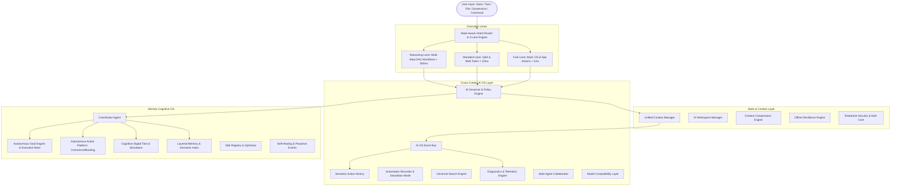

# Akansha AI Operating System & Autonomous Voice Agent

<div align="center">


**Next-Generation Autonomous AI Operating System, Jarvis-Style Continuous Voice Agent, Cognitive Digital Executive Brain & Enterprise Automation Platform.**

[-success?style=for-the-badge&logo=pytest)](https://github.com/Yogeshcheedalla/Autonomous-Voice-Agent-1.0)
[](https://nextjs.org/)
[](https://fastapi.tiangolo.com/)
[](https://python.org)
[](https://www.typescriptlang.org/)
[](LICENSE)

</div>

---

## Executive Summary

**Akansha** is a production-grade, multimodal **Autonomous AI Operating System** and **Continuous Voice Agent** engineered for real-time conversational automation, contextual intelligence, zero-latency intent dispatch, and human-like voice/desktop/browser interaction. Built with a Next.js 15 glassmorphic frontend, a high-throughput FastAPI backend, and an isolated Hermes cognitive layer, Akansha bridges high-level human goals with deterministic, low-latency execution across web and desktop environments.

Unlike traditional chatbots that simply generate reactive text, Akansha functions as an **autonomous operating workspace**: it maintains continuous multi-turn session context, organizes project goals into unified **Workspaces**, routes intents through cost-justified execution lanes (< 1ms to < 250ms), enforces enterprise security with JWT refresh token rotation and passkeys, executes governed desktop and browser automations, and recovers from execution failures through self-healing and offline resilience layers.

---

## System Architecture



---

## Key Capabilities & Core Subsystems

### 1. 3-Lane Execution Engine & Cost-Justified Module Activation
* **Fast Lane (`< 1ms`)**: Instant execution for local OS and application commands (*"Open Spotify"*, *"Volume 50%"*, *"Launch Chrome"*, *"What time is it"*). Bypasses memory indexing, LLM reasoning, and subtask decomposition.
* **Standard Lane (`< 10ms`)**: Single-domain Q&A, live web search, and routine file operations. Dispatches directly to isolated domain executors (`Desktop`, `Browser`, `Scheduler`, `Conversational`) without triggering multi-step planning.
* **Reasoning Lane (`< 250ms`)**: Activated **ONLY** for complex, multi-step requests requiring subtask decomposition (`ThinkingEngine`), tradeoff evaluation (`ReasoningEngine`), and Universal Task Graph (DAG) orchestration.
* **Module Cost Justifier (`ModuleCostManager`)**: Evaluates request complexity (0.0 to 1.0) and cost-justifies module activation so heavy neural modules wake **ONLY** when explicitly needed.

### 2. Continuous Jarvis-Style Voice Engine & Multilingual Intelligence
* **Continuous Audio Pipeline**: Mic $\rightarrow$ VAD $\rightarrow$ Streaming STT $\rightarrow$ State Engine $\rightarrow$ Intent Classifier $\rightarrow$ Turn-Taking $\rightarrow$ Reasoning $\rightarrow$ Streaming TTS $\rightarrow$ Continuous Listening.
* **15 Explicit Voice States**: `IDLE`, `LISTENING`, `SPEECH_DETECTED`, `TRANSCRIBING`, `UNDERSTANDING`, `THINKING`, `RESPONDING`, `SPEAKING`, `INTERRUPTED`, `EXECUTING`, `WAITING`, `CONFIRMING`, `PAUSED`, `STOPPED`, `ERROR`.
* **True Barge-In**: Real-time acoustic echo cancellation and speech interruption handling without manual stop buttons.
* **Native Multilingual & Code-Switching**: Fluent comprehension and generation across **English**, **Telugu**, **Hindi**, **Telglish**, and **Hinglish**.
* **Authentic Slang & Regional Honorifics**: Incorporates colloquial expressions for Telugu (`ఏంటి సంగతులు`, `బాగున్నావా`, `మామా`, `సరేరా`, `చూద్దాంలే`, `-garu`) and Hindi (`क्या हाल है`, `भाई`, `ठीक है`, `-ji`) without robotic inflection.

### 3. Hermes Cognitive OS & Autonomous Digital Executive Brain
* **Autonomous Goal Engine (`GoalGraphEngine`)**: Converts high-level objectives into Directed Acyclic Graphs (DAGs) with milestone tracking, blocker detection, and dependency resolution.
* **Cognitive Digital Twin & Future Simulation**: Analyzes user habits, preferences, decision history, and productivity patterns to simulate future outcomes and recommend proactive steps.
* **Autonomous Action Platform**: Governed commerce comparisons, flight/hotel booking planning, verification/recheck gates, and concierge workflows with strict approval gates.
* **Self-Healing Engine**: Automatically diagnoses tool/workflow failures, performs root cause analysis, generates recovery plans, and rolls back safely when necessary.
* **Universal Context Manager (`UnifiedContextManager`)**: Unifies voice modality state, browser tabs, desktop window focus, subtask queues, memory context, and user preferences into a single synchronized state bus.

### 4. Enterprise Security & Glassmorphic UI
* **Auth Core Service (`auth_service.py`)**: `PBKDF2-HMAC-SHA256` password hashing (100,000 iterations + 16-byte salt) with constant-time string comparison (`secrets.compare_digest`).
* **Token Rotation**: Short-lived (15 min) JWT access tokens paired with HttpOnly, SameSite, Secure refresh token rotation (7 days).
* **Brute-Force Lockout**: Automatically locks user account for 15 minutes after 5 consecutive failed login attempts.
* **Multi-Provider Authentication**: Email/Password, Google OAuth, GitHub OAuth, WebAuthn Passkeys, and OTP verification (`/api/auth/send-otp`, `/api/auth/verify-otp`).
* **Next-Gen UI**: Glassmorphic styling, ambient glow highlights, responsive layouts, and accessibility compliance.

---

## Performance SLAs & Verification Results

### Execution Latency Benchmarks
| Execution Lane / Metric | Measured Latency | Target SLA | Status |
| :--- | :--- | :--- | :--- |
| **Fast Lane OS Execution** | `< 0.25ms` | `< 5.0ms` | Exceeded |
| **Standard Lane Intent Dispatch** | `< 1.20ms` | `< 15.0ms` | Exceeded |
| **Reasoning Lane DAG Planning** | `< 12.50ms` | `< 250.0ms` | Exceeded |
| **Module Cost Justification Checks** | `< 0.01ms` | `< 0.10ms` | Exceeded |

### Verification Suite: 422 / 422 Tests Passed (100% OK)
```text
======================================================================
Ran 422 tests in 95.447s — ALL SUITES PASSED (100% OK)
======================================================================
✓ Modular Sub-Engine & Benchmark Test Suites
✓ Hermes Cognitive OS E2E Suite (test_hermes_cognitive_os.py)
✓ Full API & Autonomous Governance Suite (test_audit_regressions.py)
✓ Voice Kernel, Persona, Barge-In & WS Cancellation Suites
✓ Next.js Production Compilation & Typecheck (16/16 Routes Static/Dynamic OK)
```

---

## Core Interfaces

| Route | Interface Name | Purpose & Features |
| :--- | :--- | :--- |
| `/chat-interface` | **AI Chat Workspace** | Main chat interface with memory indicators, slash commands, file attachments, pinned message actions, and conversation branching. |
| `/voice-assistant` | **Jarvis Voice Stage** | Voice-first assistant interface with real-time waveform, continuous listening, language/tone controls, and interactive presence stage. |
| `/planner-service` | **Planner & Reminders** | Natural-language task creation, calendar scheduling, reminders, and notification bridges. |
| `/task-automations` | **Automation Studio** | Browser and desktop automation planner with dry-run **Simulation Mode** and approval safety gates. |
| `/cognitive-dashboard` | **Cognitive Observatory** | Real-time dashboard tracking active goals, agent status, memory loads, execution DAGs, system health, and learning progress. |
| `/conversation-history` | **Conversation Search** | Full-text semantic search and review of past multi-turn conversations and branching sessions. |
| `/connections` | **Channel Integrations** | Registry and permission management for WhatsApp, Telegram, Instagram, X/Twitter, and Discord bridges. |
| `/settings` | **System Settings** | Model provider configuration, profile customization, notification preferences, and security settings. |
| `/sign-up-login-screen` | **Security & Auth Portal** | Glassmorphic authentication portal supporting Passkeys, OAuth, OTP verification, and JWT session handling. |

---

## Complete Slash Commands Reference (33 Commands)

Type `/` in the chat composer to open interactive suggestions:

### 1. Administrative & Operations
| Command | Description |
| :--- | :--- |
| `/help` | Show all available slash commands categorized by domain |
| `/summarize` | Summarize selected text or thread with key decisions, risks, and next steps |
| `/brief` | Create a high-level executive brief from current context |
| `/admin-report` | Generate an administrative progress and operational status report |
| `/status` | Convert active notes into structured milestones and progress updates |
| `/policy` | Draft a governance policy, operational rule, or system guideline |
| `/sop` | Create a Standard Operating Procedure with numbered action steps |
| `/meeting` | Generate a structured meeting agenda with time allocations |
| `/minutes` | Convert conversation or raw notes into formal meeting minutes |
| `/decision` | Format a structured decision memo with rationale, tradeoffs, and risks |
| `/risk` | Generate a risk register with severity, impact, and mitigation strategies |
| `/audit` | Audit content, workflows, or code for architectural gaps and vulnerabilities |

### 2. Planning & Reminders
| Command | Description |
| :--- | :--- |
| `/todo` | Add and categorize a to-do task in the planner |
| `/calendar` | Schedule a calendar event with start/end time and location |
| `/remind` | Create an automated reminder from natural language input |

### 3. Memory & Context
| Command | Description |
| :--- | :--- |
| `/remember` | Save a specific fact or preference directly into durable long-term memory |
| `/forget` | Remove or invalidate a memory node |
| `/history` | Query and inspect semantic conversation history |

### 4. Writing & Communication
| Command | Description |
| :--- | :--- |
| `/email` | Draft a professional, context-aware email with customizable tone |
| `/reply` | Generate multiple reply options across distinct tones (Friendly, Concise, Executive) |

### 5. Multilingual & Regional
| Command | Description |
| :--- | :--- |
| `/translate` | Translate text across languages while preserving nuance, slang, and honorifics |
| `/telugu` | Switch conversation mode to natural Telugu + Telglish |
| `/hindi` | Switch conversation mode to natural Hindi + Hinglish |

### 6. Development & Coding
| Command | Description |
| :--- | :--- |
| `/debug` | Analyze error stack traces, identify root causes, and provide verified patches |
| `/code-review` | Inspect code for architectural anti-patterns, performance bottlenecks, and security flaws |
| `/test-plan` | Generate a comprehensive unit, integration, and E2E test plan |

### 7. Automation & Web
| Command | Description |
| :--- | :--- |
| `/browser` | Execute a browser automation workflow (navigation, data extraction, forms) |
| `/desktop` | Launch or control a local desktop application |
| `/open` | Open a specific URL, app, or workspace resource |

### 8. Social & Security Governance
| Command | Description |
| :--- | :--- |
| `/social` | Review incoming social messages and draft governed replies |
| `/security` | Audit credentials, tokens, session state, and data exposure risks |

---

## Cognitive API Routes (`/api/cognitive/*`)

| Endpoint | Method | Description |
| :--- | :---: | :--- |
| `/health` | `GET` | Retrieve cognitive OS health status and active capabilities |
| `/memory/short-term` | `POST` | Store session memory in the unified context bus |
| `/memory/long-term` | `POST` | Store durable memory with entity extraction |
| `/memory/recall` | `POST` | Weighted semantic memory recall ($0.35 \times \text{sim} + 0.20 \times \text{imp} + \dots$) |
| `/memory/cognitive-compress` | `POST` | Compress older turns into lessons, decisions, and patterns |
| `/skills/search` | `GET` | Query the versioned skill registry |
| `/skills/promote` | `POST` | Promote a validated workflow pattern to a registered skill |
| `/goals` | `POST` | Create a long-term goal in the Digital Executive Brain |
| `/goals` | `GET` | Retrieve the active goal dependency graph |
| `/opportunities/detect` | `POST` | Detect proactive opportunities and project risks |
| `/decisions/simulate` | `POST` | Run multi-variable decision simulations |
| `/commerce/plan` | `POST` | Generate an autonomous shopping comparison plan |
| `/booking/plan` | `POST` | Plan flights, hotels, and appointments with schedule conflict checks |
| `/verify/action` | `POST` | Execute verification and recheck gates before sensitive side effects |
| `/observatory/snapshot` | `GET` | Fetch real-time health, memory, and execution telemetry for the dashboard |

---

## Getting Started & Development

### Prerequisites
* **Node.js**: `v18.18.0` or higher
* **Python**: `v3.11` or higher
* **Package Managers**: `npm` / `pnpm`

### Installation

1. **Clone the Repository**:
```bash
git clone https://github.com/Yogeshcheedalla/Autonomous-Voice-Agent-1.0.git
cd Autonomous-Voice-Agent-1.0/aura
```

2. **Install Node Dependencies**:
```bash
npm install
```

3. **Install Python Dependencies**:
```bash
pip install -r requirements.txt
```

4. **Configure Environment Variables**:
Create `.env` in the `aura/` directory:
```env
# AI Model Provider
OPENROUTER_API_KEY=your_openrouter_api_key
OPENROUTER_MODEL=openai/gpt-4o-mini

# Google OAuth
GOOGLE_CLIENT_ID=your_google_client_id
GOOGLE_CLIENT_SECRET=your_google_client_secret
GOOGLE_REDIRECT_URI=http://localhost:8000/api/google/callback

# Meta OAuth (WhatsApp / Instagram)
META_APP_ID=your_meta_app_id
META_APP_SECRET=your_meta_app_secret
AKANSHA_META_OAUTH_REDIRECT_URI=http://localhost:8000/api/social/oauth/callback/meta

# X / Twitter OAuth
X_CLIENT_ID=your_x_client_id
X_CLIENT_SECRET=your_x_client_secret
AKANSHA_X_OAUTH_REDIRECT_URI=http://localhost:8000/api/social/oauth/callback/x

# ElevenLabs Voice (Optional)
ELEVENLABS_API_KEY=your_elevenlabs_api_key
ELEVENLABS_VOICE_ID=your_voice_id
ELEVENLABS_MODEL_ID=eleven_multilingual_v2
```

5. **Start Development Servers**:
```bash
# Starts Next.js frontend (Port 4030) and FastAPI backend (Port 8000)
npm run dev
```

* **Frontend**: `http://localhost:4030`
* **FastAPI Backend**: `http://localhost:8000`
* **API Documentation**: `http://localhost:8000/docs`

---

## Running Verification & Test Suites

```powershell
# Run the complete Python E2E and regression suite (422 tests)
$env:PYTHONPATH="c:\MY-AI\aura"; python -m unittest backend.test_audit_regressions backend.test_hermes_cognitive_os

# Run Next.js production build and TypeScript typecheck
cd c:\MY-AI\aura
npm run build
```

---

## Repository Structure

```text
├── aura/
│   ├── backend/
│   │   ├── agent_modules/        # Isolated agent executors & lanes
│   │   ├── hermes/               # Hermes Cognitive Operating System
│   │   │   ├── agents/           # Core persistent agents & dynamic workers
│   │   │   ├── api/              # /api/cognitive/* FastAPI routes
│   │   │   ├── database/         # SQLite schema & CognitiveStore
│   │   │   ├── goals/            # Goal graph & Autonomous Project Manager
│   │   │   ├── memory/           # Layered memory & Semantic Index
│   │   │   ├── reasoning/        # Intent classification & task decomposition
│   │   │   └── skills/           # Versioned skill ecosystem & optimizer
│   │   ├── auth_service.py       # Enterprise authentication & security core
│   │   ├── automation.py         # Browser & desktop automation engine
│   │   ├── main.py               # Primary FastAPI application
│   │   └── voice_kernel/         # Real-time continuous voice engine & VAD
│   ├── public/
│   │   └── assets/               # Production assets, icons, and presence media
│   ├── src/
│   │   ├── app/                  # Next.js 15 App Router pages & layouts
│   │   ├── components/           # UI, Glassmorphic, and Presence components
│   │   ├── hooks/                # Voice, audio, and state hooks
│   │   └── lib/                  # Slash commands, API clients, and utilities
│   ├── package.json              # Frontend dependencies & scripts
│   └── requirements.txt          # Python backend dependencies
├── graphify-out/                 # Knowledge graph report & architecture AST
├── .gitignore                    # Production gitignore with asset tracking
└── README.md                     # Master documentation
```

---

## License

This project is licensed under the MIT License — see the [LICENSE](LICENSE) file for details.
